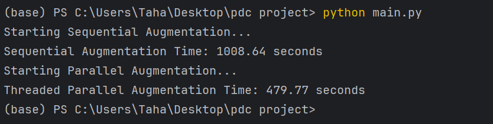
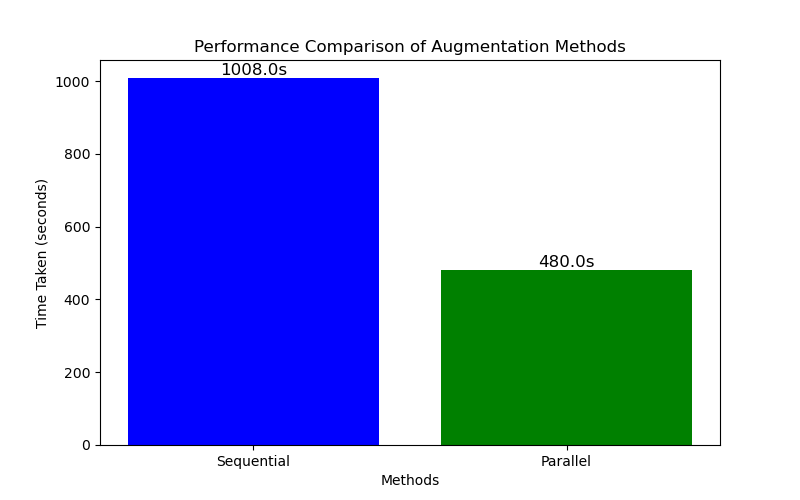

# Image Augmentation with Sequential and Parallel Processing

This project demonstrates image augmentation using sequential, multiprocessing, and threading approaches in Python. The goal is to optimize performance for large datasets and measure the effectiveness of different approaches.

---

## Features
- **Sequential Augmentation**: Processes images one by one.
- **Parallel Augmentation**: Leverages multiprocessing for faster augmentation.
- **Threaded Augmentation**: Utilizes threading for I/O-bound tasks.
- **Performance Comparison**: Evaluates the time taken by each approach.

---
## Dataset

The dataset required for this project is too large to be included directly in the repository. You can download it from the following link:

[Download Dataset](https://www.kaggle.com/datasets/emmarex/plantdisease)

---
## Performance Results and Graph

<div style="display: flex; flex-direction: row; justify-content: space-around; align-items: center;">
    <div>
        <h4>Output Console</h4>
        
    </div>
    <div>
        <h4>Performance Graph</h4>
        
    </div>
</div>


---

## Dependencies
These are the dependencies required for the project and their functions:
1. **`matplotlib`**: Used to generate graphs for performance comparison.
2. **`Pillow`**: For image manipulation like cropping, flipping, and rotating.
3. **`multiprocessing`**: Enables parallel processing for faster image augmentation (standard library, no installation required).
4. **`concurrent.futures`**: Provides threading support for I/O-bound tasks (standard library, no installation required).
5. **`os`**: For file and directory operations (standard library, no installation required).
6. **`time`**: For tracking execution times (standard library, no installation required).

To install these dependencies, run:
```bash
pip install -r requirements.txt
## Setup and Usage

### 1. Clone the Repository
```bash
git clone https://github.com/Tahamallick/ImgBoost.git
cd ImgBoost
```

### 2. Install Dependencies
Install the required Python libraries using:
```bash
pip install -r requirements.txt
```

### 3. Run the Project
Run the main script to execute sequential and parallel augmentation:
```bash
python main.py
```

---

## Implementation Details

### Core Augmentation Methods
1. **Rotation**: Rotates the image by 90°, 180°, or 270° randomly.
2. **Flipping**: Horizontally flips the image.
3. **Cropping**: Crops the image to 80% of its original dimensions.

### Processing Approaches
- **Sequential**:
   - Processes each image one at a time.
   - Useful for small datasets but slow for large ones.
- **Parallel**:
   - Uses Python’s `multiprocessing` and `threading`  to process images concurrently.
   - Ideal for CPU-bound tasks.

---


---


